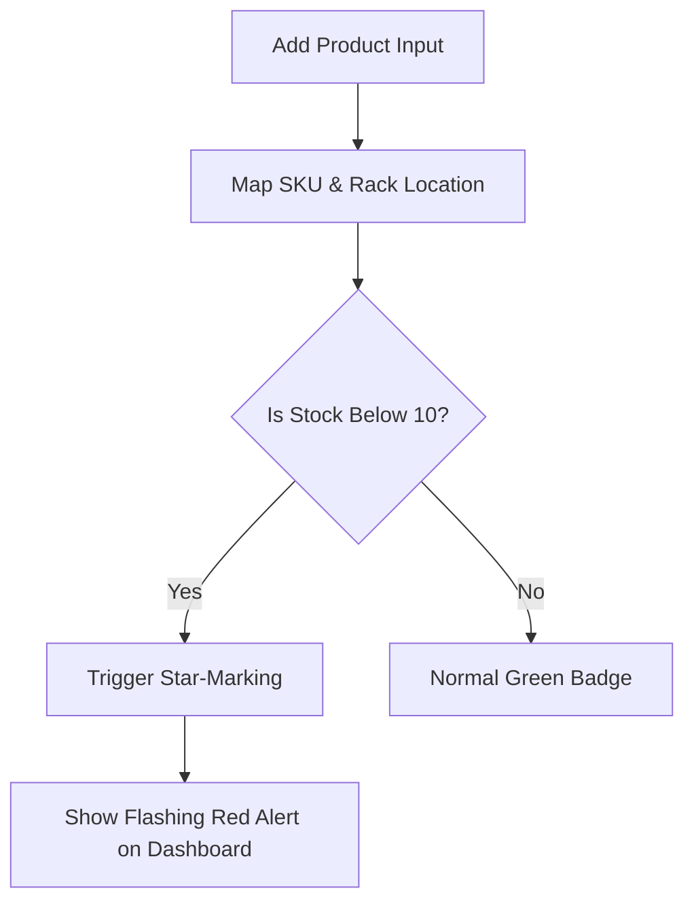
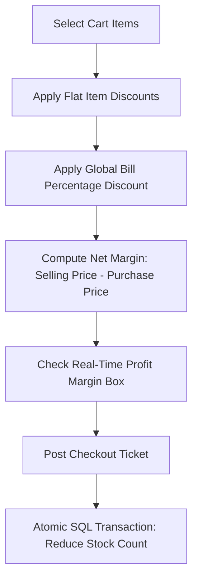
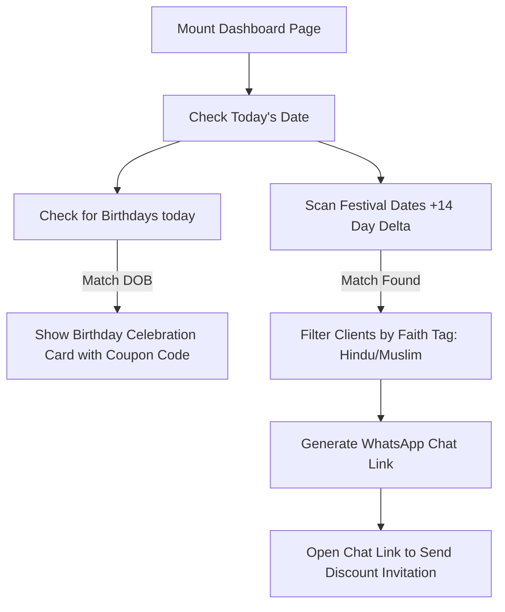
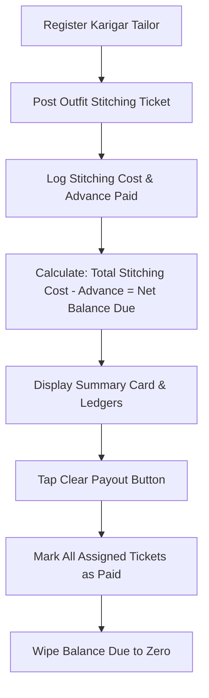

# Humjoli Safa ERP & CRM - Deployment & Operations Guide

Welcome! This guide explains how to install, run, and use the **Humjoli Safa ERP & CRM** application. 

---

## 1. Directory & Database Structure

The project has two main folders: **backend** and **frontend**. 

*   **Backend:** Handles the server logic, calculations, and database.
*   **Frontend:** Renders the screen, input forms, and layouts.

Here is the folder structure:

| Folder / File Path | Type | What It Does |
| :--- | :--- | :--- |
| `backend/` | Directory | Contains the server code, database scripts, and API routes. |
| `backend/index.js` | JavaScript File | The main server script. Binds to your local network. |
| `backend/database.js` | JavaScript File | Creates tables and seeds data like Indian festivals. |
| `frontend/` | Directory | Contains the user interface pages built with React and Vite. |
| `frontend/src/pages/` | Directory | Individual web pages (Dashboard, Billing, Tailors, Inventory). |
| **`hd_safa.db`** *(Root Folder)* | SQLite Database File | **IMPORTANT:** This file stores all your database records (Products, Clients, Sales, Tailors). **Back up this file to copy your data!** |

---

## 2. Logical Workflow Charts

### A. Inventory Star-Alert Workflow
This checker flags items that are running low on stock.



### B. POS Checkout & Margin Workflow
This engine calculates profit margins in real time and updates stock.



### C. Festival & Birthday Outreach Campaigns
This engine reads calendar dates to generate outreach templates.



### D. Karigar (Tailor) Ledger Tracking
This system monitors stitching balances and advance records.



---

## 3. Desktop Deployment & Operation Guide

Follow these steps to deploy and run the app on a client's computer.

### Step 1: Install Node.js
1. Download **Node.js** (LTS version) from the official website.
2. Run the installer. Keep clicking "Next" until it is done.

### Step 2: One-Click Startup Script
We can create a Windows Batch script to launch the app automatically. 

1. Create a file named `Start_Humjoli_Safa.bat` in the root folder (`e:\Client Projects\ERP + CRM\Start_Humjoli_Safa.bat`).
2. Paste the following script inside it:

```bat
@echo off
title Humjoli Safa ERP Launcher
echo ==============================================
echo STARTING HUMJOLI SAFA ERP & CRM NETWORKS...
echo ==============================================
echo.
echo [1/3] Terminating any existing node processes...
taskkill /f /im node.exe >nul 2>&1
echo.
echo [2/3] Installing workspace dependencies...
call npm run install-all
echo.
echo [3/3] Booting backend & frontend servers concurrently...
echo Application will launch on: http://localhost:3000/
echo.
npm run dev
pause
```

3. Double-click **`Start_Humjoli_Safa.bat`** to run the app instantly!

---

## 4. Local Network Wi-Fi Synchronization

The boutique owner and staff can access the dashboard on their phones at the same time without paying hosting fees.

```
[ Boutique Shop Wi-Fi Router ]
       |
       +---> Host Windows PC (Runs Database & API Server)
       |
       +---> Owner's iPhone (Scans QR Code, views ledgers)
       |
       +---> Helper's Android Tablet (Creates checkout bills)
```

### Setup Instructions:
1. **Connect Devices:** Make sure the host PC and all mobile devices are connected to the **same Wi-Fi router**.
2. **Launch App:** Run `Start_Humjoli_Safa.bat` on the host PC.
3. **Scan QR Code:** 
    *   Look at the sidebar on the PC screen.
    *   Open the camera app on your phone or tablet.
    *   Point it at the QR code.
    *   Tap the link to open the portal.
4. **Use Mobile Layout:** The system automatically shifts to a bottom navigation bar, making it behave like a native iOS/Android app.
